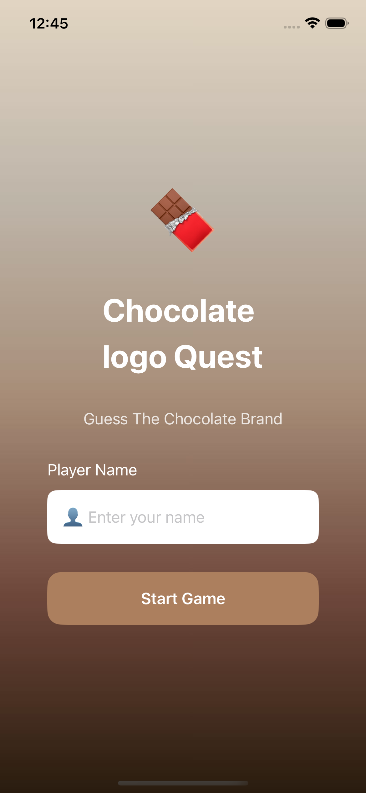
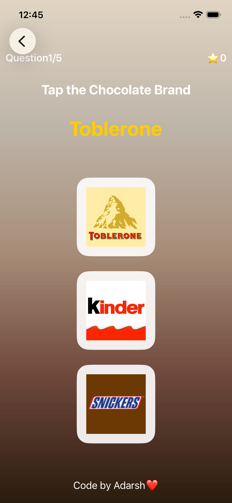
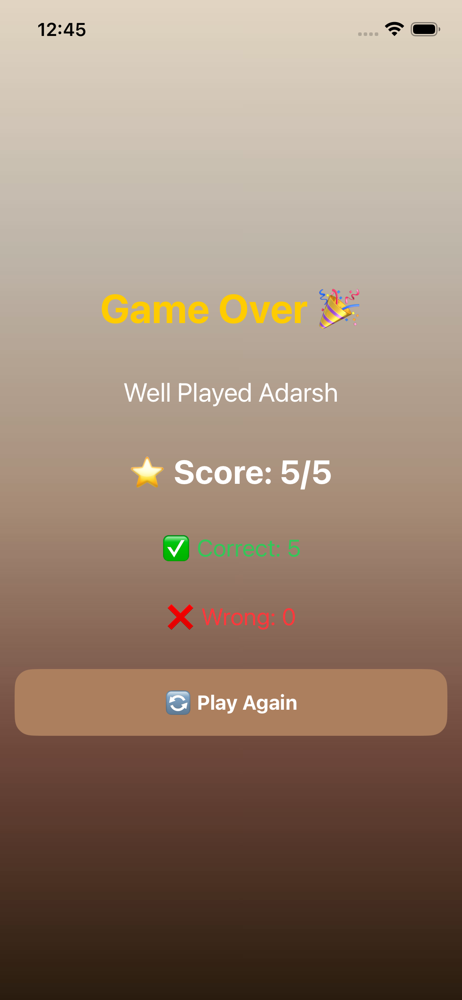

# 🍫 Guess the Chocolate Brand

A fun and interactive **SwiftUI quiz game** where players test their knowledge by identifying chocolate brands from their logos. The game features randomized questions, score tracking, and a clean user interface built entirely with **SwiftUI**.

---

# 📸 Screenshots

| Home Screen | Game Screen | Result Screen |
|--------------|-------------|---------------|
|  |  |  |

---

# ✨ Features

- 👤 Enter player name before starting
- 🍫 Guess the correct chocolate brand logo
- 🎲 Randomized questions every game
- 🎯 Five-question gameplay
- 📊 Live score tracking
- 🏆 Final result screen
- 🔄 Play Again functionality
- 📱 Responsive and clean SwiftUI interface

---

# 📚 What I Learned

Through this project, I gained hands-on experience with:

- Building a complete multi-screen SwiftUI application
- Managing navigation using `NavigationStack`
- Handling state using `@State`
- Creating reusable data models with `struct`
- Passing data between multiple views
- Implementing game logic using Swift
- Displaying image assets dynamically
- Randomizing questions using `shuffled()`
- Organizing a SwiftUI project into Models and Views

---

# 🛠️ Technologies Used

- Swift
- SwiftUI
- Xcode

---

# 📂 Project Structure

```
Day 14
│
├── Guess the chocolate brand/
│   ├── GuessTheChocolateBrand.xcodeproj
│   ├── GuessTheChocolateBrand/
│   └── ...
│
├── Screenshots/
│   ├── home.png
│   ├── game.png
│   └── result.png
│
├── Image/
│
└── README.md
```

---

# 🧠 SwiftUI Concepts Used

- NavigationStack
- NavigationLink
- @State
- VStack
- HStack
- ZStack
- Spacer
- Button
- Image
- TextField
- Struct
- Arrays
- Functions
- Conditional Statements
- Randomization (`shuffled()`)
- View Composition

---

# 🚀 Future Improvements

- ⏱️ Add a countdown timer
- 🔊 Add sound effects
- 🎨 Improve animations and transitions
- 🌙 Support Dark Mode
- 🏅 Add a leaderboard
- 💾 Save high scores locally
- 📈 Add multiple difficulty levels

---

# ▶️ Getting Started

### Clone the repository

```bash
git clone https://github.com/your-username/100-days-of-ios.git
```

### Open the project

Navigate to:

```
Day 14/Guess the chocolate brand/
```

Open the `.xcodeproj` file in **Xcode**.

### Run the app

- Select an iPhone Simulator.
- Press **⌘ + R** to build and run.

---

# 👨‍💻 Author

**Adarsh Kashyap**

🎓 B.Tech CSE Student  
📱 Aspiring iOS Developer  
💡 Passionate about Swift, SwiftUI, and building impactful iOS applications.

🌐 **Portfolio:**  
https://codewithadarsh08.netlify.app/

---

## ⭐ If you enjoyed this project, consider giving it a star on GitHub!
